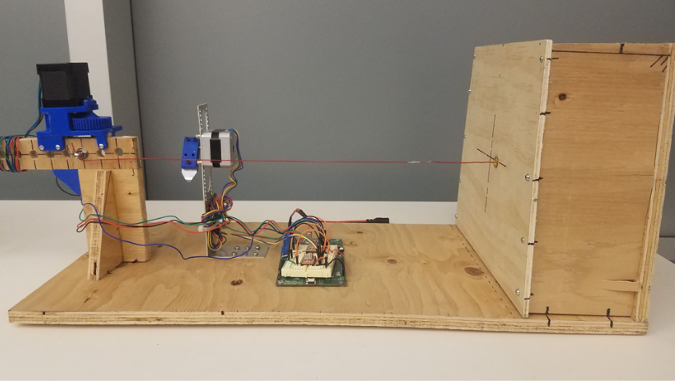
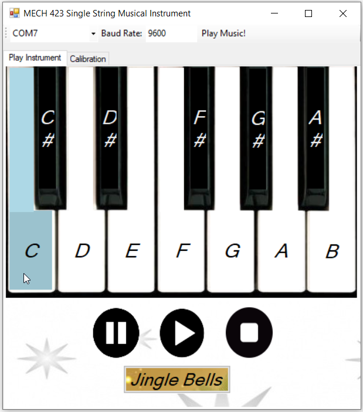
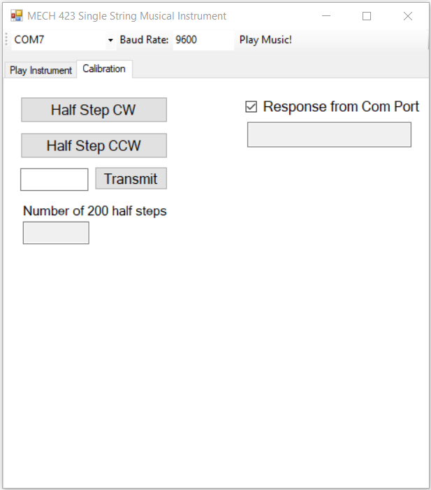

# MECH423 - Single String Musical Instrument

For the MECH423 final project, I and my partner, Juanes Bustamante, designed a single string musical instrument which consists of a soundboard, harp string and stepper motors to adjust the tension of and pluck the harp string. Please check the video of the instrument in action under final_project_video folder. 

To play piano notes and/or jingle bells on the instrument, I designed a GUI using C#. The GUI connects to the TI board over UART through a COM port. The screenshot below shows the play tab of the GUI used to control the single string musical instrument.

The calibration tab, as shown below, is used to calibrate the stepper motor position to play the notes on one octave.

